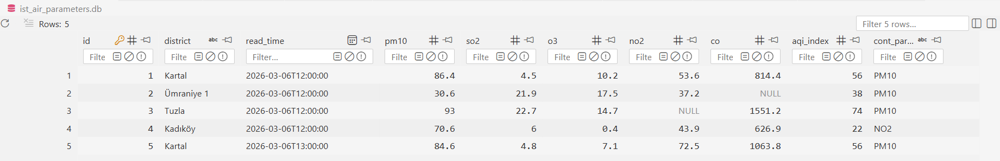

## Istanbul Air Tracker 
This is a simple data pipeline that extracts live air quality metrics from the [Istanbul Metropolitan Municipality (IBB) Open Data Portal](https://data.ibb.gov.tr/en/dataset/hava-kalitesi-istasyon-bilgileri-web-servisi). Historical data is stored locally, and a real-time air quality analysis and public health advice is generated using a Generative AI.

### Tech & Architecture

* **Language:** Python
* **Data Source:** IBB Open Data REST API
* **Database:** SQLite 
* **Generative AI:** `gemini-2.5-flash`

### Sample Output

```
Air quality analyses for Istanbul, Kadıköy at March 6, 2:00 PM:
General explanation
Good news for Kadıköy! The air quality today is excellent, with an Air Quality Index (AQI) of 15.0. This means the air is clean and poses minimal health risks for everyone in the district. While we observe Nitrogen Dioxide (NO2) as the main pollutant contributing to this low AQI today, its levels are well within healthy limits, indicating a very clear day.

advices on activities:
Given such excellent air quality, everyone can freely enjoy all outdoor activities without any restrictions. It's a perfect day to exercise outdoors, go for a walk in the park, or simply spend time outside with family and friends without worrying about air pollution. No special precautions or limitations are needed today.

have a nice day
```
### Database Schema
Extracted data is saved to a relational database with SQLite:


### How to Run Locally

1. Clone the repository:
   ```bash
   git clone https://github.com/middaycoffee/istanbul-air-tracker.git
   cd istanbul-air-tracker
   ```

2. Set up your environment variables:
   * Create a file named `.env` in the root directory.
   * Add your Gemini API key: 
     ```text
     GEMINI_API_KEY="your_api_key_here"
     ```

3. Install dependencies:
   ```bash
   pip install -r requirements.txt
   ```

4. Run the application:
   ```bash
   python main.py
   ```
   *The script will automatically initialize the `ist_air_parameters.db` database on its first run.*
